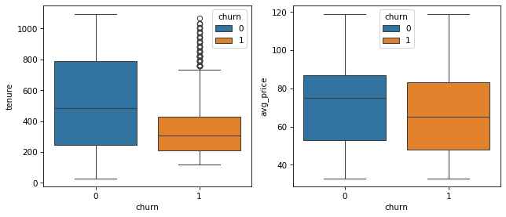
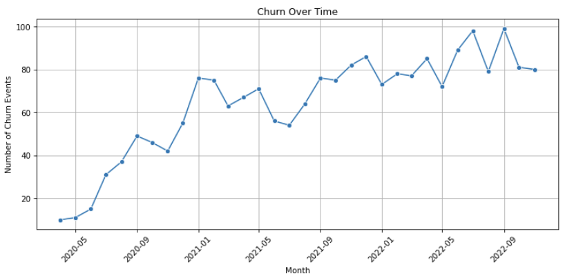
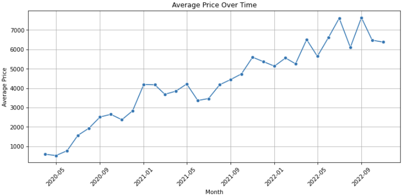
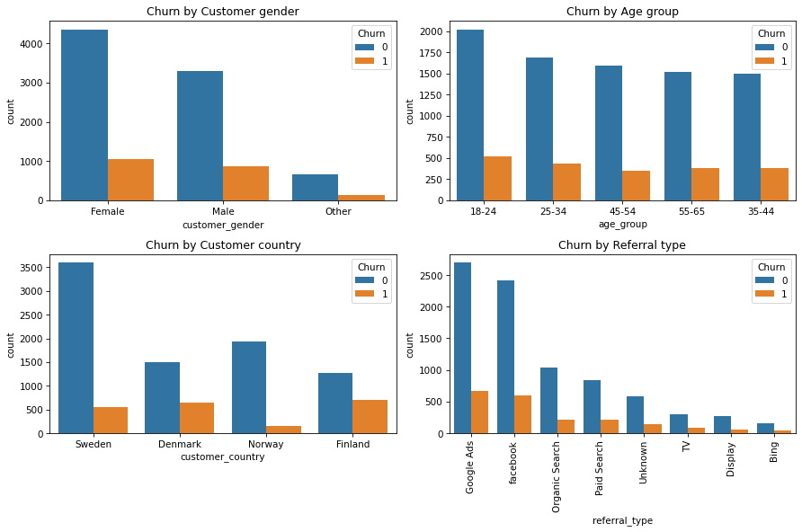
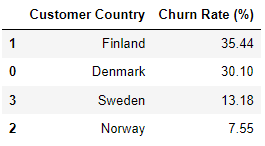
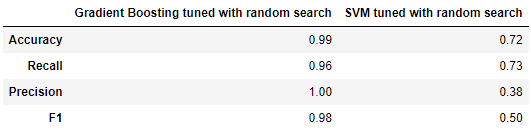
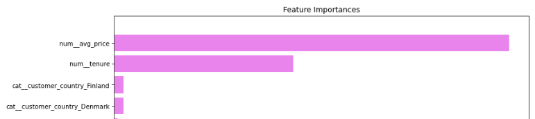

# Subscription Churn Prediction

## Overview

I aimed to predict subscription churn by analyzing user behavior and  to understand factors influencing churn. Insights derived from this analysis can help guide targeted strategies to enhance customer retention. The dataset was sourced from [Kaggle](https://www.kaggle.com/datasets/sarathperingayi/performance-of-a-subscription-business).

## Data
The dataset encompasses transactional and demographic information. Variables include:

* cust_id
* transaction_type 
* transaction_date
* subscription_type 
* subscription_price
* customer_gender
* age_group
* customer_country
* referral_type
    
I extracted the target variable 'churn' from 'transaction_type'. I then cleaned the data by removing duplicate transaction dates and types then aggregated the data to get it into a shape that's usable for modeling with one customer per record. The final data preparation step was engineering the following features.

* acquisition_date
* end_date (churn date or max date for non-churned customers)
* tenure (end_date - acquisition_date)
* avg_price

**EDA highlights**  

Churned customers have much shorter tenures and generally pay lower average prices than non-churners. 

The following two lineplots are aggregated by all customers and indicate an increasing trend in churn and average price over three years. 

Customers in Finland have the highest churn rate compared to the other countries. The remaining categorical features vs. churn were split more evenly and did not reveal any significant insights.

## Methodology

I split the dataset 80/20 train/test and transformed numerical and categorical features using standard scaler and one-hot encoding. 

Since churn has steadily increased, I optimized recall to offer the company the greatest opportunity to identify customers at risk of churning and to intervene with targeted retention efforts. 

I tested out two linear and three non-linear algorithms and evaluated them using Stratified K-Folds and cross-validation with 5 splits.

* Logistic Regression 
* Linear Discriminant Analysis
* Support Vector Classification 
* Random Forest 
* Gradient Boosting Classifier

## Results 

Gradient Boosting Classifier (GB) and Support Vector Classification (SVC) had the highest average cross-validated recall on training data with 81% and 76%, respectively. I tuned these two models with RandomizedSearchCV and produced the following results for recall. 

Training performance:
* GB increased to 97% from 81%
* SVC increased to 82% from 76%

Test performance:
* GB generalized well: 96%
* SVC overfit: 73% 

Test performance comparison of the following four metrics:

Top four feature importances of the final GB model:

## Conclusion and Recommendations

* 'churn' and 'avg_price' increased steadily over three years, indicating that the company lacks effective marketing strategies.
* The company should identify customers in lower-priced plans or those who have downgraded and implement marketing strategies to retain them by offering incentives to upgrade.
* The most frequent (mode) avg_price is $53, which aligns with the 'BASIC' plan, so the company should take a close look at this opportunity to target those customers and retain them with offers for upgrades.
* The company should dive deep into what's working well in Norway and Sweden, which have much higher retention rates (up to 5x that of Finland), and test  similar marketing strategies for customers in Finland.
